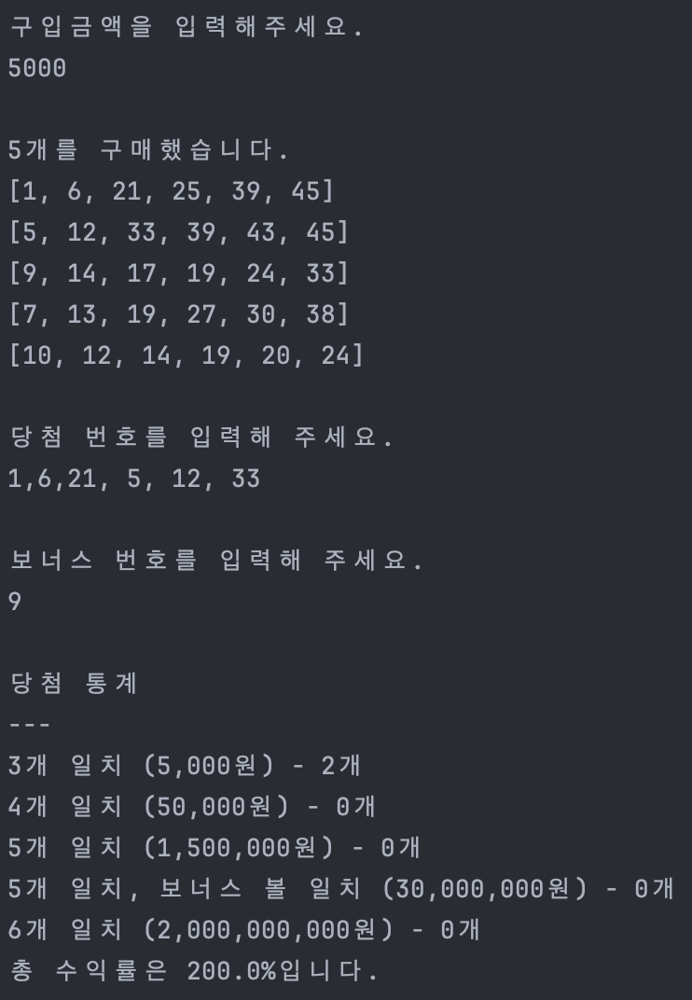

# javascript-lotto-precourse

### 🚥 [CHANGELOG.md 바로가기](./CHANGELOG.md)

# 🎱 기능 소개



## 입력

**[InputHandler Class](./src/handler/InputHandler.js)**

- 사용자로부터 값을 입력받아서 반환한다.
- 숫자가 아닌 값을 입력하면 에러를 던진다.
- 정수가 아닌 값을 입력하면 에러를 던진다.
- 여러 개의 숫자를 입력하는 경우 구분자가 포함되어 있지 않으면 에러를 던진다.

### 로또 구입 금액을 입력받는다.

**[PriceInputHandler Class](./src/handler/PriceInputHandler.js)**

### 당첨 번호를 입력받는다.

**[PriceInputHandler Class](./src/handler/PriceInputHandler.js)**

## 게임 실행

**[App Class](./src/App.js)**

- 로또 게임을 실행한다.

### 사용자가 잘못된 값을 입력한 경우 해당 부분 부터 다시 입력받는다.

**[RepeatHandler Class](./src/handler/RepeatHandler.js)**

- 함수를 전달받아 실행하고 에러가 발생한 경우 해당 함수를 다시 실행한다.

### 구입 금액만큼 로또를 구매한다.

**[LottoMaker Class](./src/lotto/LottoMaker.js)**

- 구입 금액만큼 **[Lotto Class](./src/lotto/Lotto.js)** 를 생성한다.
- 전달 받은 금액이 최소 구입 금액 미만인 경우 에러를 던진다.
- 전달 받은 금액이 로또 가격 단위로 나누어 떨어지지 않는 경우 에러를 던진다.

**[Lotto Class](./src/lotto/Lotto.js)**

- 입력 받은 로또 번호 개수가 올바르지 않은 경우 에러를 던진다.
- 입력 받은 로또 번호에 중복된 값이 존재하면 에러를 던진다.
- 입력 받은 로또 번호 중 유효하지 않은 범위의 숫자가 존재하면 에러를 던진다.

### 당첨 로또를 계산한다.

**[LottoResult Class](./src/result/LottoResult.js)**

- 구입한 로또와 당첨 로또 번호를 비교하여 당첨된 번호의 개수만큼 **[Result Class](./src/result/Result.js)** 의 count 를 증가시킨다.
- 5개의 번호가 일치하는 경우 보너스 번호의 일치 여부를 확인한다.

**[Result Class](./src/result/Result.js)**

- 일치하는 번호의 개수(match), 상금(price), 결과 개수(count)를 관리한다.
- `const fiveMatch = new Result(5, 1_500_000, 0)`

### 수익률을 게산한다.

**[RewardCalculator Class](./src/lotto/RewardCalculator.js)**

- 구입 금액과 상금으로 수익률을 계산한다.

### 에러가 발생하면 [ERROR] 로 시작하는 메세지를 출력한다.

**[ExceptionHandler Class](./src/handler/ExceptionHandler.js)**
- 발생한 에러의 메세지를 출력한다.

## 출력

### 구매한 로또를 출력한다.

**[LottoPrintHandler Class](./src/handler/LottoPrintHandler.js)**

- 출력 형식에 맞게 구매한 로또를 출력한다.

### 당첨 결과와 수익률을 출력한다.

**[ResultPrintHandler Class](./src/handler/ResultPrintHandler.js)**

- 출력 형식에 맞게 당첨 결과와 수익률을 출력한다.

# 🔨 구현할 기능 목록

- 로또 구입 금액을 입력 받는다.

  ```
  구입금액을 입력해주세요.
  ```
  ```
  14000
  ```

- [x] 구입 금액은 1,000원 단위로 입력받는다.
- [x] 1000원으로 나누어 떨어지지 않는 경우 예외처리 한다.
- [x] 공백을 입력한 경우 예외처리 한다.
- [x] 구입 금액에 해당하는 만큼 로또를 발행한다.


- 당첨 번호를 입력받는다.

  ```
  당첨 번호를 입력해 주세요.
  ```
  ```
  1,2,3,4,5,6
  ```

- [x] 번호는 쉼표(,)를 기준으로 구분한다.
- [x] 당첨 번호는 모두 정수인 숫자이다.
- [x] 당첨 번호는 모두 가능한 로또 범위 내의 숫자이다.
- [x] 로또 번호는 중복을 허용하지 않는다.
- 보너스 번호를 입력받는다.
  ```
  보너스 번호를 입력해 주세요.
  ```
  ```
  7
  ```

- 발행한 로또 수량 및 번호를 출력한다.
  ```
  8개를 구매했습니다.
  [8, 21, 23, 41, 42, 43]
  [3, 5, 11, 16, 32, 38]
  [7, 11, 16, 35, 36, 44]
  [1, 8, 11, 31, 41, 42]
  [13, 14, 16, 38, 42, 45]
  [7, 11, 30, 40, 42, 43]
  [2, 13, 22, 32, 38, 45]
  [1, 3, 5, 14, 22, 45]
  ```

  - [x] 로또 번호는 오름차순으로 정렬하여 보여준다.

- 사용자가 구매한 로또 번호와 당첨 번호를 비교한다.

- 당첨 내역 및 수익률을 출력한다.
  ```
  당첨 통계
  ---
  3개 일치 (5,000원) - 1개
  4개 일치 (50,000원) - 0개
  5개 일치 (1,500,000원) - 0개
  5개 일치, 보너스 볼 일치 (30,000,000원) - 0개
  6개 일치 (2,000,000,000원) - 0개
  총 수익률은 62.5%입니다.
  ```
  - [x] 수익률은 소수점 둘째 자리에서 반올림한다.
  - ex) `100.0%`, `51.5%`, `1,000,000.0%`


- [x] 로또 게임을 종료한다.
- [x] 사용자가 잘못된 값을 입력할 경우 ‘throw’문을 사용해 예외를 발생시킨다.
- [x] `[ERROR]`로 시작하는 에러 메시지를 출력한다.
- [x] 해당 부분부터 다시 입력받는다.
  ```
  [ERROR] 숫자가 잘못된 형식입니다.
  [ERROR] 로또 번호는 1부터 45 사이의 숫자여야 합니다.
  ```
- [x] 에러 문구는 "[ERROR]"로 시작해야 한다.