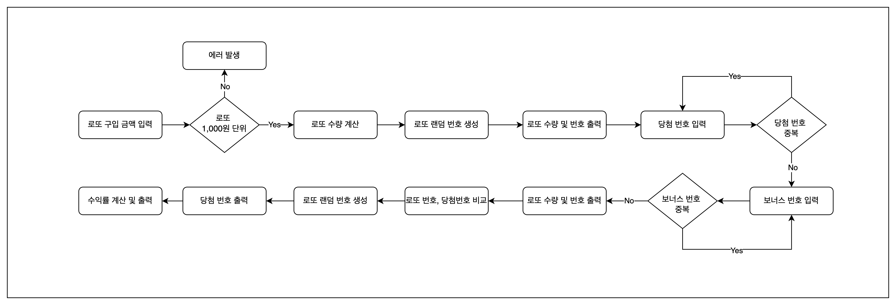

# [Week 3] 로또

## ☁️ 학습 목표

- 관련 함수를 묶어 클래스 만들기
- 클래스와 함수에 대한 단위 테스트 수행

## 📍 요구 사항

로또 발매기 구현

- 로또 번호의 숫자 범위는 1~45
- 1개의 로또를 발행할 때, 중복되지 않는 6개의 숫자 뽑기
- 당첨 번호 추첨 시, 중복되지 않는 숫자 6개와 보너스 번호 1개 뽑기
- 당첨은 1등부터 5등까지

  | 등수 | 당첨 기준                   | 금액            |
  | ---- | --------------------------- | --------------- |
  | 1등  | 6개 번호 일치               | 2,000,000,000원 |
  | 2등  | 5개 번호 + 보너스 번호 일치 | 30,000,000원    |
  | 3등  | 5개 번호 일치               | 1,500,000원     |
  | 4등  | 4개 번호 일치               | 50,000원        |
  | 5등  | 3개 번호 일치               | 5,000원         |

- 로또 구입 금액을 입력하면 구입 금액에 해당하는 만큼 로또 발행
- 로또 1장의 가격은 1,000원
- 당첨 번호와 보너스 번호 입력 받기
- 구매한 로또 번호와 당첨 번호를 비교하여 당첨 내역 및 수익률을 출력하고 게임 종료
- 잘못된 값 입력 시, 에러 발생 후 종료

## ✅ 구현해야 할 기능

- [x] 로또 구입 금액 입력
- [x] 로또 구입 금액 유효성 검증

  - [x] 빈 값 여부
  - [x] 숫자 타입 여부
  - [x] 1,000원 단위 여부

- [x] 발행한 로또 수량 계산
- [x] 로또 수량 만큼 로또 번호 랜덤 생성 및 Lotto 인스턴스 생성
- [x] 로또 수량 및 번호 출력 (오름차순 정렬)
- [x] 당첨 번호 입력 받기 (쉼표를 기준으로 구분)
- [x] 보너스 번호 입력 받기
- [x] 당첨 번호 및 보너스 번호 유효성 검증

  - [x] 빈 값 여부
  - [x] 숫자 타입 여부
  - [x] 숫자 범위 여부

- [x] 당첨 번호 및 보너스 번호 중복 체크

- [x] 구매한 로또 번호와 당첨 번호 비교
- [x] 당첨 내역 출력
- [x] 수익률 계산
- [x] 수익률 출력 (소수점 둘째 자리에서 반올림)
- [x] 에러 처리

## 🖊️ 흐름도 설계



## 👩🏻‍💻 구현 내용 정리

### 검증 기능 클래스화 및 상속

공통된 검증 기능들이 많아서 부모 클래스를 만들고 각 금액, 로또 번호, 당첨 번호, 보너스 번호 검증은 해당 클래스를 상속하여 활용

- Validator.js

```js
class Validator {
  static isEmpty(input) {
    if (!input) throwError(ERROR_MESSAGES.EMPTY_INPUT);
    return input;
  }

  static isSeparatedFormat(input, separator = ",") {
    const values = input.split(separator).map((value) => value.trim());
    if (values.length <= 1) throwError(ERROR_MESSAGES.INVALID_SEPARATOR);
    return values;
  }

  // ...
}

export default Validator;
```

- AmountValidator.js

```js
class AmountValidator extends Validator {
  static isMultipleOfThousand(input) {
    if (input % LOTTO.AMOUNT_UNIT !== 0)
      throwError(ERROR_MESSAGES.NOT_MULTIPLE_OF_THOUSAND);
    return input;
  }

  static validate(input) {
    return _pipe(
      this.isEmpty,
      this.isNumber,
      this.isNagativeNumber,
      this.isZero,
      this.isMultipleOfThousand
    )(input);
  }
}

export default AmountValidator;
```

### 로또 서비스 클래스

로또들에 대해 생성, 비교, 수익률 계산 로직을 처리

```js
class LottoService {
  #lottos;

  constructor() {
    this.#lottos = [];
  }

  getLottos() {
    return [...this.#lottos];
  }

  generateLottos(count) {
    //...
  }

  compareLottos(winningNumbers, bonusNumber) {
    //...
  }

  calculateProfit(matchCounts, amount) {
    //...
  }

  //...
}

export default LottoService;
```

### RANK 객체

각 등수에 대해 match 개수, bonus 여부, 금액, 메시지를 관리

```js
const RANKS = Object.freeze({
  FIFTH: {
    match: 3,
    bonus: false,
    prize: 5000,
    message: "3개 일치 (5,000원) - ",
  },
  FOURTH: {
    match: 4,
    bonus: false,
    prize: 50000,
    message: "4개 일치 (50,000원) - ",
  },
  THIRD: {
    match: 5,
    bonus: false,
    prize: 1500000,
    message: "5개 일치 (1,500,000원) - ",
  },
  SECOND: {
    match: 5,
    bonus: true,
    prize: 30000000,
    message: "5개 일치, 보너스 볼 일치 (30,000,000원) - ",
  },
  FIRST: {
    match: 6,
    bonus: false,
    prize: 2000000000,
    message: "6개 일치 (2,000,000,000원) - ",
  },
});

export default RANKS;
```
