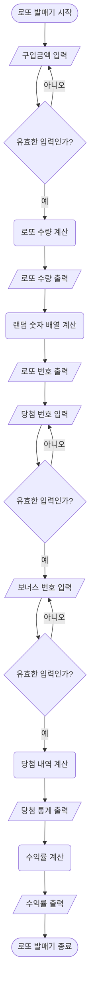

# javascript-lotto-precourse

# 🎱 로또 발매기 구현하기

## 로또 발매기 로직

1. 사용자에게 구입금액을 입력받는다.
2. 구입금액에 맞춰 구입한 로또수를 출력한다.
3. 로또수에 맞게 6개의 랜덤숫자로 이루어진 배열을 출력한다.
4. 당첨 번호를 입력받는다.
5. 보너스 번호를 입력받는다.
6. 입력받은 당첨번호와 보너스번호를 각 배열에 비교한다.
7. 3개 이상 일치하는 배열들을 골라 당첨 통계를 계산한다.
8. 당첨통계를 출력한다.
9. 구입한 금액 대비 수익률을 계산하여 출력한다.
10. 로또 발매기가 종료된다.

## Flowchart

## ⚙️ 구현할 기능

### 🟢 1. 구입금액 입력

- 🗓️ 기능

  - 사용자에게 구입금액을 입력받는다.

- ❗️ 요구사항

  - 구입금액은 1,000원 단위로 입력 받으며 1,000원으로 나누어 떨어지지 않는 경우 예외 처리한다.
  - 로또 1장의 가격은 1000원이다.

- 🔎 예시
  - 출력 문구
    ```
    구입금액을 입력해 주세요.
    ```
  - 사용자 입력
    ```
    8000
    ```

### 🟢 2. 로또 구매

- 🗓️ 기능

  - 구입금액에 맞춰 구입한 로또수를 출력한다.

- ❗️ 요구사항

  - 구입 금액 만큼 로또를 발행해야 한다.

- 🔎 예시
  - 출력 문구
    ```
    8개를 구매했습니다.
    ```

### 🟢 3. 로또 발행

- 🗓️ 기능

  - 로또수에 맞게 6개의 랜덤숫자로 이루어진 배열을 출력한다.

- ❗️ 요구사항

  - 로또 번호의 숫자 범위는 1~45까지이다.
  - 로또 번호는 오름차순으로 정렬하여 보여준다.
  - 각 배열의 숫자는 중복되지 않는다.

- 🔎 예시
  - 출력 문구
    ```
    [8, 21, 23, 41, 42, 43]
    [3, 5, 11, 16, 32, 38]
    [7, 11, 16, 35, 36, 44]
    [1, 8, 11, 31, 41, 42]
    [13, 14, 16, 38, 42, 45]
    [7, 11, 30, 40, 42, 43]
    [2, 13, 22, 32, 38, 45]
    [1, 3, 5, 14, 22, 45]
    ```

### 🟢 4. 당첨번호 입력

- 🗓️ 기능

  - 당첨번호를 입력받는다.

- ❗️ 요구사항

  - 번호는 쉼표(,)를 기준으로 구분한다.
  - 중복되지 않는 숫자를 받는다.

- 🔎 예시
  - 출력 문구
    ```
    당첨 번호를 입력해 주세요.
    ```
  - 사용자 입력
    ```
    1,2,3,4,5,6
    ```

### 🟢 5. 보너스 번호 입력

- 🗓️ 기능

  - 보너스 번호를 입력받는다.

- ❗️ 요구사항

  - 당첨번호와 중복되지 않는 숫자를 받는다.
  - 보너스 숫자는 하나만 받을 수 있다.

- 🔎 예시
  - 출력 문구
    ```
    보너스 번호를 입력해 주세요.
    ```
  - 사용자 입력
    ```
    7
    ```

### 🟢 6. 당첨 내역 확인

- 🗓️ 기능

  - 당첨 내역을 계산한다.

- ❗️ 요구사항
  - 입력받은 당첨번호와 보너스번호를 비교하여 각 배열 별로 일치하는 개수를 반환한다.
  - 3개 이상 일치하는 배열들을 골라 당첨 통계를 계산한다.

### 🟢 7. 당첨통계 출력

- 🗓️ 기능

  - 당첨통계를 출력한다.

- ❗️ 요구사항

  - 1등부터 5등가지 당첨 기준과 금액에 맞게 출력한다.
  - 일치 숫자를 오름차순으로 정리한다.

- 🔎 예시
  - 출력 문구
    ```
    3개 일치 (5,000원) - 1개
    4개 일치 (50,000원) - 0개
    5개 일치 (1,500,000원) - 0개
    5개 일치, 보너스 볼 일치 (30,000,000원) - 0개
    6개 일치 (2,000,000,000원) - 0개
    ```

### 🟢 8. 수익률 계산

- 🗓️ 기능

  - 구입한 금액 대비 수익률을 계산하여 출력한다.

- ❗️ 요구사항

  - 수익률은 소수점 둘째 자리에서 반올림한다. (ex. 100.0%, 51.5%, 1,000,000.0%)

- 🔎 예시
  - 출력 문구
    ```
    총 수익률은 62.5%입니다.
    ```
