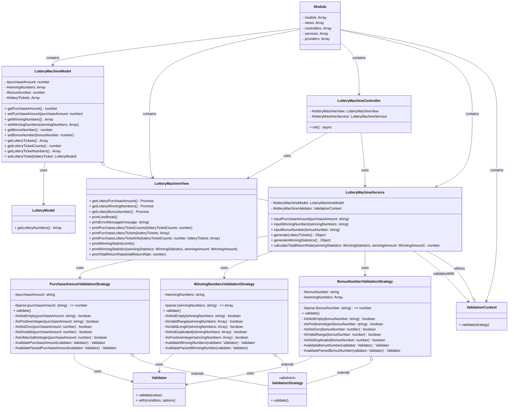

# javascript-lotto-precourse

## 구현 기능 목록

### Order

- [x] 로또 구입 금액을 입력 받는다.
- [x] 유효한 로또 구입 금액이 입력됐는지 확인한다.
- [x] 로또 구입 금액을 바탕으로 구입 금액에 해당하는 만큼 로또를 발행한다.
- [x] 당첨 번호를 입력 받는다.
- [x] 유효한 당첨 번호가 입력됐는지 확인한다.
- [x] 보너스 번호를 입력 받는다.
- [x] 유효한 보너스 번호가 입력됐는지 확인한다.
- [x] 사용자가 구매한 로또 번호와 당첨 번호를 비교하여 당첨 내역 및 수익률을 계산한다.
- [ ] 당첨 내역 및 수익률을 반환하고 로또 게임을 종료한다.

## 구현 후

### 📁 Structure

```bash
src
├── lib
│   ├── Module.js
│   ├── testUtils.js
│   ├── utils.js
│   ├── Validator.js
│   └── view.js
├── lottery-machine
│   ├── lottery-machine.controller.js
│   ├── lottery-machine.model.js
│   ├── lottery-machine.module.js
│   ├── lottery-machine.service.js
│   └── lottery-machine.view.js
├── validation
│   ├── bonus-number-validation.strategy.js
│   ├── purchase-amount-validation.strategy.js
│   ├── validation.context.js
│   ├── validation.strategy.js
│   └── winning-numbers-validation.strategy.js
├── App.js
├── index.js
└── Lotto.js
test
├── bonus-number-validation.strategy.test.js
├── lottery-machine.service.test.js
├── Module.test.js
├── purchase-amount-validation.strategy.test.js
├── utils.test.js
└── winning-numbers-validation.strategy.test.js
```

### 📝 Description

- `MVC(Model-View-Controller)` 패턴을 적용하여 예측가능한 구조를 만들기 위해 노력하였습니다.
- `Service Layer`을 추가하여 비지니스 로직을 분리하기 위해 노력했습니다.
- `Strategy Pattern`을 활용하여 유효성 검증 로직을 분리하고 유연하게 관리할 수 있게 만들기 위해 노력했습니다.
- `OOP(Object-Oriented Programming)` 관점에서 문제를 해결하기 위해 노력했습니다.
- `선언적인(Declarative)` 코드를 작성하기 위해 노력했습니다.
- 가능한 모든 함수에 테스트를 작성하기 위해 노력했습니다.
- `type-safe`한 코드를 작성하기 위해 노력했습니다.
- 가능한 작은 함수를 만들기 위해 노력했습니다.

### ♻️ Object


