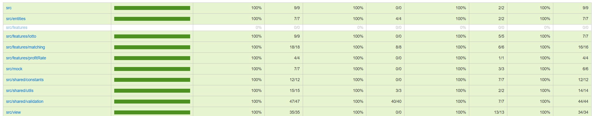

# 🎰 프리코스 3주차 미션 - 로또

## 📝 프로젝트 소개

구매 금액을 통해 무작위 번호를 발행하는 로또 프로그램을 구현합니다.
발행된 로또는 당첨 번호와 보너스 번호를 통해 당첨 여부와 수익률을 계산합니다.

## ⚙️ 개발 요구사항

- indent depth 2 이하
- 함수당 최대 15라인
- 단위 테스트 작성 (UI 로직 제외)
- `@woowacourse/mission-utils` 패키지 사용
  - `Random.pickUniqueNumbersInRange()`
  - `Console.readLineAsync()`, `Console.print()`
- 에러 메시지는 `[ERROR]`로 시작
- 3항 연산자 사용 금지
- else 사용 지양

## 🎯 주요 기능

- 1,000원 단위 금액으로 로또 구매
- 1~45 범위의 중복되지 않는 6개 번호 자동 생성
- 당첨 번호 및 보너스 번호 입력
- 당첨 통계 및 수익률 계산

## 🎮 실행 예시

```bash
구입금액을 입력해 주세요.
8000

8개를 구매했습니다.
[8, 21, 23, 41, 42, 43]
[3, 5, 11, 16, 32, 38]
...

당첨 번호를 입력해 주세요.
1,2,3,4,5,6

보너스 번호를 입력해 주세요.
7

당첨 통계
---
3개 일치 (5,000원) - 1개
4개 일치 (50,000원) - 0개
5개 일치 (1,500,000원) - 0개
5개 일치, 보너스 볼 일치 (30,000,000원) - 0개
6개 일치 (2,000,000,000원) - 0개
총 수익률은 62.5%입니다.
```

### 💰 당첨 기준

| 일치 개수 | 보너스볼 | 상금            |
| --------- | -------- | --------------- |
| 6개       | -        | 2,000,000,000원 |
| 5개       | ⭕       | 30,000,000원    |
| 5개       | ❌       | 1,500,000원     |
| 4개       | -        | 50,000원        |
| 3개       | -        | 5,000원         |

### ✅ 기능 요구사항

| 카테고리        | 구현 내용                                         | 상태 |
| --------------- | ------------------------------------------------- | ---- |
| **초기 설정**   | 로또 게임 설정값 생성                             | ✅   |
| **입력 처리**   | `구입금액을 입력해 주세요.` 출력                  | ✅   |
|                 | 사용자 구입 금액을 전달받아 로또 구매 개수 판단   | ✅   |
| **금액 검증**   | 1000원 단위 금액 검증                             | ✅   |
|                 | 10만원 초과 금액 검증                             | ✅   |
| **로또 발행**   | 중복되지 않는 랜덤 6개 숫자 생성                  | ✅   |
|                 | 로또 번호 오름차순 정렬                           | ✅   |
|                 | 발행 로또 배열 저장                               | ✅   |
| **출력 처리**   | 구매 개수와 발행 로또 순차 출력                   | ✅   |
| **당첨 번호**   | 당첨 번호 입력 안내 출력                          | ✅   |
|                 | 쉼표(,) 구분 당첨 번호 입력 처리                  | ✅   |
|                 | 당첨 번호 유효성 검증 (1-45 범위, 6개, 중복 없음) | ✅   |
| **보너스 번호** | 보너스 번호 입력 안내 출력                        | ✅   |
|                 | 보너스 번호 입력 처리 (1-45 범위)                 | ✅   |
| **당첨 처리**   | 당첨 여부 확인 및 등수 분류                       | ✅   |
|                 | 등수별 당첨 개수 출력                             | ✅   |
| **수익률 계산** | 구매 금액 대비 당첨 금액 수익률 계산              | ✅   |
|                 | 수익률 소수점 둘째 자리 반올림 출력               | ✅   |

### 🎫 로또 발행

| 기능      | 설명                           |
| --------- | ------------------------------ |
| 금액 입력 | 1,000원 단위, 최대 100,000원   |
| 번호 생성 | 1~45 범위의 중복없는 6개 숫자  |
| 결과 출력 | 오름차순 정렬된 로또 번호 목록 |

### 🎯 당첨 확인

| 기능             | 설명                      |
| ---------------- | ------------------------- |
| 당첨 번호 입력   | 쉼표(,)로 구분된 6개 숫자 |
| 보너스 번호 입력 | 1~45 범위의 1개 숫자      |
| 통계 출력        | 등수별 당첨 개수와 수익률 |

## 🚨 예외 처리 항목

| 구분          | 예외 상황                      | 상태 |
| ------------- | ------------------------------ | ---- |
| **구매 금액** | 숫자가 아닌 입력값             | ✅   |
|               | 빈 값 입력                     | ✅   |
|               | 1000원 단위가 아닌 금액        | ✅   |
| **당첨 번호** | 빈 값 입력                     | ✅   |
|               | 숫자가 아닌 입력값 (쉼표 제외) | ✅   |
|               | 1-45 범위 외 숫자              | ✅   |
|               | 6개 미만 숫자                  | ✅   |
|               | 6개 초과 숫자                  | ✅   |
|               | 중복 숫자 입력                 | ✅   |

---

> 참고: **모든 에러 상황**에서 해당 부분부터 입력을 다시 받습니다.

## 🌴 테스트 커버리지


단위(unit) 테스트 를 통해서 코드 플로우 내에서 테스트 커버리지 **100% 달성**
