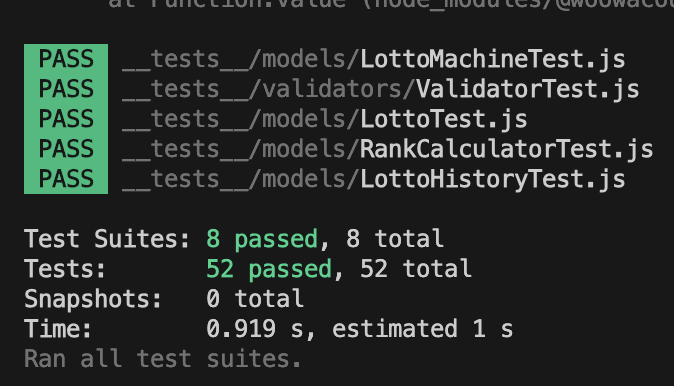

# **💸 로또**

## ▶️ 실행 결과

<!-- 실행 영상 추가 -->

<br/>

## 🦯 실행 방법

다음 명령어를 통해 프로그램을 실행할 수 있습니다.

```bash
 // 1. clone을 통해 자신의 pc로 복제
 git clone https://github.com/rosielsh/javascript-lotto-7.git
 // 2. 브랜치 변경
 git checkout rosielsh
 // 3. 의존성 설치
 npm install
 // 4. 프로그램 실행
 npm run start
```

<br/>

## **⚙️** 기능 목록

프로그램의 주요 기능 목록입니다.
각 기능은 올바른 동작과 예외 상황을 포함하며 총 7개의 흐름으로 구성되어 있습니다.

1. **구입금액 입력**

   - 로또 구입 금액을 1,000원 단위로 입력할 수 있다.
   - **값을 입력할 경우 에러 메세지를 출력하고 다시 올바른 입력을 할 때까지 입력을 받는다.**
   - 예외) 1,000원 단위가 아닌 경우
   - 예외) 숫자가 아닌 경우

   ```
   🖨️ - 구입금액을 입력해 주세요.
   🧑🏻‍💻 - 8000
   ```

2. **로또 생성**
   - 로또를 구입한 갯수만큼 로또를 생성한다.
   - 로또 번호의 숫자 범위는 **1~45**까지이다.
   - 1개의 로또를 발행할 때 **중복되지 않는 6개의 숫자**를 뽑는다.
3. **로또 수량 및 번호 조회**

   - 로또를 구입한 갯수만큼 **로또 번호를 조회**할 수 있다.
   - 각 로또의 번호는 **오름차순**으로 볼 수 있다.

   ```
   🖨️ - 3개를 구매했습니다.
   		[8, 21, 23, 41, 42, 43]
   		[3, 5, 11, 16, 32, 38]
   		[7, 11, 16, 35, 36, 44]
   ```

4. **당첨번호 입력**

   - 당첨 번호를 입력할 수 있다. (**쉼표**를 기준으로 구분)
   - **중복되지 않는 숫자 6개**를 입력받는다.
   - **값을 입력할 경우 에러 메세지를 출력하고 다시 올바른 입력을 할 때까지 입력을 받는다.**
   - 예외) 숫자가 아닌 요소가 있는 경우
   - 예외) 6개가 아닌 경우
   - 예외) 중복되는 숫자가 있는 경우
   - 예외) 로또의 숫자 범위에서 벗어나는 경우(1~45 사이)

   ```
   🖨️ - 당첨 번호를 입력해 주세요.
   🧑🏻‍💻 - 1,2,3,4,5,6
   ```

5. **보너스 번호 입력**

   - 보너스 번호를 입력할 수 있다.
   - **값을 입력할 경우 에러 메세지를 출력하고 다시 올바른 입력을 할 때까지 입력을 받는다.**
   - 예외) 숫자가 아닌 경우
   - 예외) 로또의 숫자 범위에서 벗어나는 경우(1~45 사이)
   - 예외) 보너스 번호가 당첨 번호와 중복되는 경우

   ```
   🖨️ - 보너스 번호를 입력해 주세요.
   🧑🏻‍💻 - 7
   ```

6. **당첨 등수 구하기**
   - 당첨은 1~5등까지 있다.
   - 기준은 아래와 같다.
     ```
     - 1등: 6개 번호 일치 / 2,000,000,000원
     - 2등: 5개 번호 + 보너스 번호 일치 / 30,000,000원
     - 3등: 5개 번호 일치 / 1,500,000원
     - 4등: 4개 번호 일치 / 50,000원
     - 5등: 3개 번호 일치 / 5,000원
     ```
7. **당첨 내역 조회**

   - 당첨 여부 계산이 끝나면 내역을 조회할 수 있다.
   - 수익률은 소수점 둘째자리에서 반올림한다. (즉, 첫째자리까지 조회할 수 있다.)

   ```
   🖨️  당첨 통계
     ---
   	3개 일치 (5,000원) - 1개
   	4개 일치 (50,000원) - 0개
   	5개 일치 (1,500,000원) - 0개
   	5개 일치, 보너스 볼 일치 (30,000,000원) - 0개
   	6개 일치 (2,000,000,000원) - 0개
   	총 수익률은 62.5%입니다.
   ```

<br/>

## 📦 클래스 목록

`MVC` 패턴에 맞게 각각의 객체를 분리했습니다.

| 구분            | 클래스명                  | 역할                                               |
| --------------- | ------------------------- | -------------------------------------------------- |
| 📊 `Model`      | `Lotto`                   | 하나의 로또 정보를 관리하고 유효성 검사            |
|                 | `LottoHistory`            | 구매한 로또의 수량과 목록 관리                     |
|                 | `LottoMachine`            | 로또를 발행하고 기록                               |
|                 | `RankCalculator`          | 당첨 결과를 계산                                   |
|                 | `LottoRank`               | 당첨 등수 정보를 기록                              |
|                 | `RankResult`              | 당첨 결과를 등수와 상금으로 관리                   |
|                 | `RandomGenerator`         | 로또 생성기                                        |
| 👀 `View`       | `InputView`               | 입력 처리                                          |
|                 | `OutputView`              | 출력 처리                                          |
| 🎮 `Controller` | `LottoController`         | 전체 흐름을 처리                                   |
|                 | `LottoPurchaseController` | 로또의 구매를 처리하는 컨트롤러                    |
|                 | `LottoResultController`   | 로또 결과를 처리하는 컨트롤러                      |
|                 | `WinningNumberController` | 로또의 당첨 번호와 보너스 번호를 처리하는 컨트롤러 |

<br/>

## 📁 디렉터리 구조

```
📁
├── README.md
└── 📁 src
    ├── App.js
    ├── 📁 constants
    │   ├── Message.js
    │   └── Setting.js
    ├── 📁 controllers
    │   ├── LottoController.js
    │   ├── LottoPurchaseController.js
    │   ├── LottoResultController.js
    │   └── WinningNumberController.js
    ├── 📁 dto
    │   ├── PurchaseDTO.js
    │   └── RankDTO.js
    ├── 📁 index.js
    ├── 📁 models
    │   ├── Lotto.js
    │   ├── LottoHistory.js
    │   ├── LottoMachine.js
    │   ├── LottoRank.js
    │   ├── RandomGenerator.js
    │   ├── RankCalculator.js
    │   └── RankResult.js
    ├── 📁 utils
    │   ├── InputHandler.js
    │   ├── Utils.js
    │   └── generateError.js
    ├── 📁 validators
    │   ├── BonusNumberValidator.js
    │   ├── PurchaseMoneyValidator.js
    │   ├── Validator.js
    │   └── WinningNumbersValidator.js
    └── 📁 views
        ├── InputView.js
        └── OutputView.js
```

<br/>

## 단위 테스트 목록

총 52개의 단위 테스트 실행 결과 `passed` 처리된 것을 확인했습니다.

[레포지토리 내 테스트 코드](https://github.com/rosielsh/javascript-lotto-7/tree/rosielsh/__tests__)



<br/>

## 📋 리팩토링 기준

아래의 리팩토링 기준을 준수하기 위해 노력했습니다.

- [x] 함수가 여러 개의 기능을 하지 않도록 한다.
- [x] 함수의 길이가 15라인이 넘지 않는지 확인한다.
- [x] 값을 하드코딩하지 않는다.
- [x] `Javascript Style Guide`를 준수했는지 점검한다.
- [x] `indent의` `depth를` 3이상 작성하지 않았는지 점검한다.
- [x] 3항 연산자를 작성하지 않았는지 확인한다.
- [x] `else를` 지양하고 `early return` 적용한다.

<br/>
