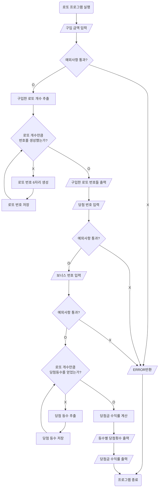

# javascript-lotto-precourse

## 기능 요구 사항

간단한 로또 발매기를 구현한다.

- 로또 번호의 숫자 범위는 1~45까지이다.
- 1개의 로또를 발행할 때 중복되지 않는 6개의 숫자를 뽑는다.
- 당첨 번호 추첨 시 중복되지 않는 숫자 6개와 보너스 번호 1개를 뽑는다.
- 당첨은 1등부터 5등까지 있다. 당첨 기준과 금액은 아래와 같다.
- 1등: 6개 번호 일치 / 2,000,000,000원
- 2등: 5개 번호 + 보너스 번호 일치 / 30,000,000원
- 3등: 5개 번호 일치 / 1,500,000원
- 4등: 4개 번호 일치 / 50,000원
- 5등: 3개 번호 일치 / 5,000원
- 로또 구입 금액을 입력하면 구입 금액에 해당하는 만큼 로또를 발행해야 한다.
- 로또 1장의 가격은 1,000원이다.
- 당첨 번호와 보너스 번호를 입력받는다.
- 사용자가 구매한 로또 번호와 당첨 번호를 비교하여 당첨 내역 및 수익률을 출력하고 로또 게임을 종료한다.
- 사용자가 잘못된 값을 입력할 경우 "[ERROR]"로 시작하는 메시지와 함께 Error를 발생시키고 해당 메시지를 출력한 다음 해당 지점부터 다시 입력을 받는다.

## 구현 기능 목록

### 1. 구입금액 입력

구입 금액을 입력받는다.

- 구입 금액은 양수로 이루어진 숫자여야 한다.
- 구입 금액은 1000 단위로 나눠 떨어진다.
- 입력값 앞뒤 공백은 trim() 시킨다.

#### 입력 예외사항. (ERROR 반환)

- 입력값이 없을경우
- 입력이 숫자가 아닐 경우
- 입력이 정수가 아닌 경우
- 입력 값이 1000 보다 작은 경우
- 입력 값이 1000단위로 나위어 떨어지지 않는 경우

#### 입력 예시

```
구입금액을 입력해 주세요.
8000
```

### 2. 구입한 로또 개수 추출

구입금액을 1000으로 나누어 구입할 로또 개수를 추출한다.

### 3. 로또 번호 생성기 생성

로또 번호를 구입 갯수만큼 생성하는 로또 번호 생성기를 만든다.

- `Random.pickUniqueNumbersInRange(1, 45, 6)`함수를 이용하여 로또 번호 6개를 생성한다.
- 생성된 로또 번호를 오름차순으로 정렬한다.

### 4. 로또 개수 만큼 번호 생성

위의 로또 번호 생성기를 이용해 로또 구입개수만큼 로또번호를 배열로 생성한다.

### 5. 생성된 로또 번호 출력

만들어진 로또 번호 배열들을 순서대로 출력한다.

#### 출력 예시

```
8개를 구매했습니다.
[8, 21, 23, 41, 42, 43]
[3, 5, 11, 16, 32, 38]
[7, 11, 16, 35, 36, 44]
[1, 8, 11, 31, 41, 42]
[13, 14, 16, 38, 42, 45]
[7, 11, 30, 40, 42, 43]
[2, 13, 22, 32, 38, 45]
[1, 3, 5, 14, 22, 45]
```

### 6. 당첨 번호 입력

당첨번호 6자리를 입력받는다.

- 입력 번호는 콤마(,) 로 구분된다.
- 입력받은 번호는 6개여야 하며 1~45 사이의 정수여야 한다.
- 6자리는 서로 중복되지 않아야 한다.
- 입력값 사이사이 공백이 있는경우 trim()시킨다. ( 1, 2,3, 4,5,6 ==> [1,2,3,4,5,6])

#### 입력 예외사항 (ERROR 반환)

- 입력된 값이 없을경우
- 입력된 값이 6개가 아닌 경우
- 입력된 값이 공백이 입력된 경우(ex: 1,2,3,,5,6)
- 입력된 값들이 숫자가 아닌 경우
- 입력된 값들이 정수가 아닌 경우
- 입력된 값이 1~45 사이의 정수가 아닌 경우
- 입력된 값끼리 서로 중복되는 경우

#### 입력 예시

```
당첨 번호를 입력해 주세요.
1,2,3,4,5,6
```

### 7. 보너스 번호 입력

보너스 번호 1자리를 입력받는다.

- 보너스 번호는 당첨번호 6자리와 중복되지 않아야 한다.
- 보너스 번호는 1~45 사이의 정수여야 한다.
- 입력된 번호 앞뒤 공백은 trim() 시킨다.

#### 입력 예외사항

- 입력된 값이 없을경우
- 입력된 값이 숫자가 아닌 경우
- 입력된 값이 정수가 아닌 경우
- 입력된 값이 1~45 사이의 정수가 아닌 경우
- 입력된 값이 당첨번호와 중복될 경우

#### 입력 예시

```
보너스 번호를 입력해 주세요.
7
```

### 8. 당첨 통계 계산

1. 로또 번호 배열을 받아 당첨 번호와 비교하여 일치하는 번호 개수를 추출한다.
2. 일치 번호 개수가 5개인 경우 보너스 번호와 비교하여 일치시 2등여부를 확인한다.
3. 등수 별 당첨 로또 개수를 반환한다.
4. 구입한 등수 별 당첨 로또 개수를 가격으로 환산 후 구입 금액에 대한 수익률을 구하여 반환한다.

- 수익률은 소수점 둘째 자리에서 반올림 한다.
- 수익률은 1000단위로 ,로 구분된다.
- 예시: `100 => 100.0%` , `62.5 => 62.5%`, `42.565 => 42.6%`, `6000000.456 => 6,000,000.5%`

#### 수익률 계산 공식

`(당첨 금액) / (구입 금액) x 100`

### 10. 당첨 통계 출력

1. 등수 별 당첨된 로또 개수를 출력한다.
2. 수익률을 출력한다.

#### 출력 형식 예시

```
당첨 통계
---
3개 일치 (5,000원) - 1개
4개 일치 (50,000원) - 0개
5개 일치 (1,500,000원) - 0개
5개 일치, 보너스 볼 일치 (30,000,000원) - 0개
6개 일치 (2,000,000,000원) - 0개
총 수익률은 62.5%입니다.
```

### 로또 추첨기 Flow chart


