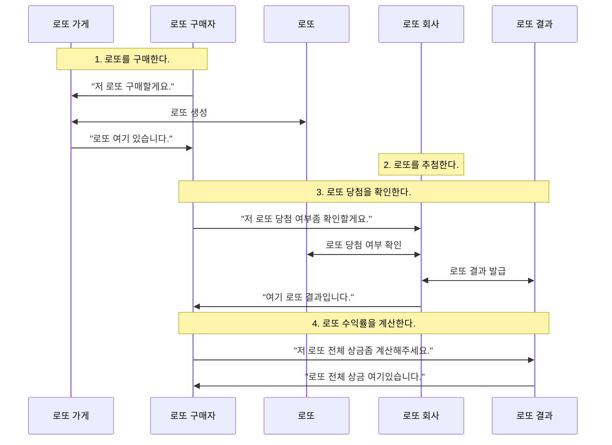
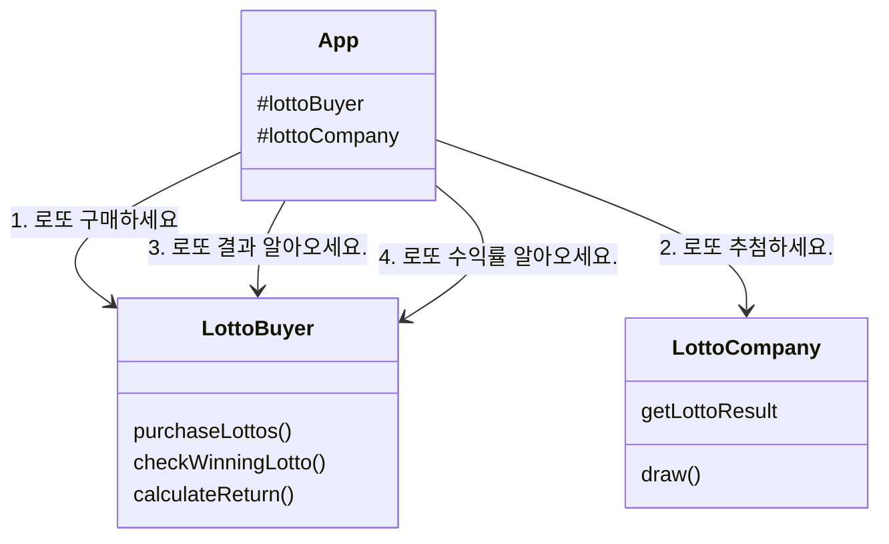
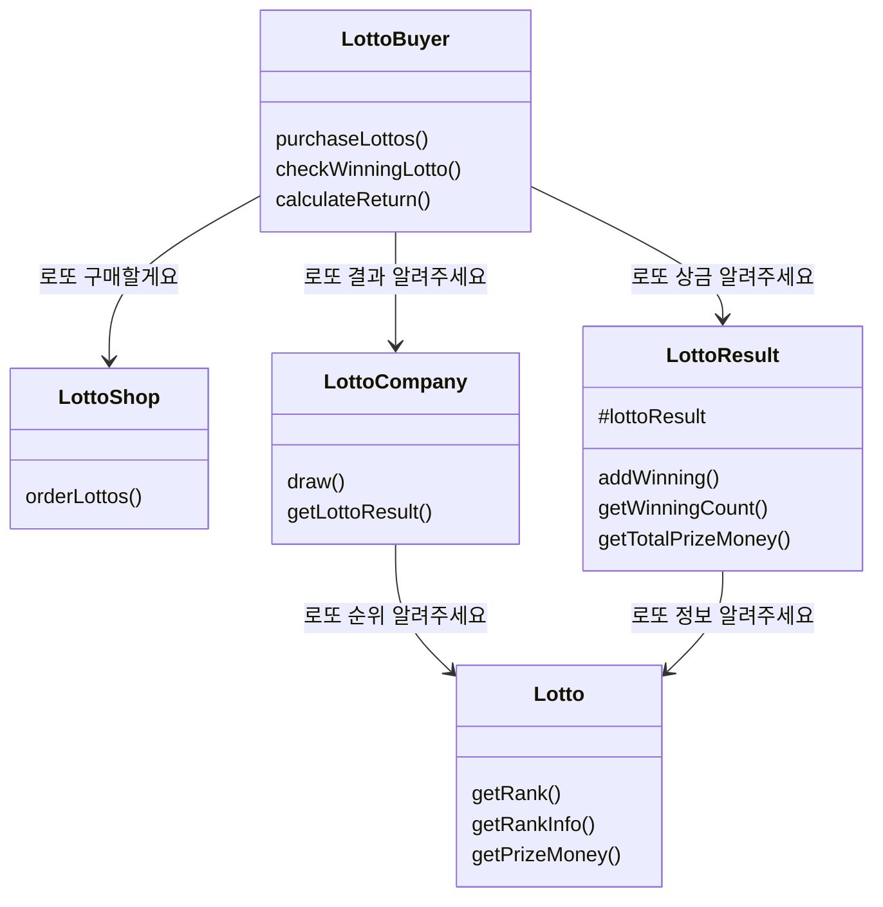

# javascript-lotto-precourse

## 🏄🏼‍♂️ 프로젝트 소개

저는 프로젝트에 대한 풀이를 스토리텔링 방식으로 풀어냈습니다.

그럼 이제 로또를 구매하는 소년에 대한 이야기를 시작하겠습니다.

```
오늘은 로또를 구매하는 날입니다. 한 소년이 로또 가게에서 로또를 구매했습니다.

며칠 후 로또를 추첨하는 날이 다가왔습니다. 로또 회사에서는 로또를 추첨을 합니다.

소년은 로또 회사의 당첨 체크 시스템을 이용해 로또 결과를 발급받습니다.

이제 소년은 로또로 얻은 수익률을 계산합니다.
```

이렇게 로또를 구매한 소년에 대한 이야기는 끝이 납니다.

프로젝트에 대한 이해를 현실 세계에 빗대어 생각해보았습니다. 위와 같은 이야기를 순서도로 옮기면 아래와 같습니다.

### 순서도



이 순서도를 코드에 옮긴 것이 바로 [App.js](./src//App.js)입니다.

## 코드 설명

### 1. 클래스

클래스는 세 가지로 나뉩니다.

1. [App](./src/App.js)
   1. `App` : 이야기의 전개를 담당합니다.
2. [이야기에 등장하는 클래스](./src/objects/)
   1. `LottoBuyer` : 로또를 구매하는 오늘의 주인공입니다.
   2. `LottoCompany` : 로또를 추첨하는 로또 회사입니다.
   3. `LottoShop` : 로또를 판매하는 로또 가게입니다.
   4. `Lotto` : 로또입니다.
   5. `LottoResult` : 로또 당첨 결과지입니다.
3. [컨트롤러 클래스](./src/controllers/)
   1. `InputController` : 사용자로부터 입력을 받습니다.
   2. `OutputController` : 사용자에게 결과를 출력합니다.

현실 세계에서 로또 가게, 로또 회사, 로또는 움직일 수 없는 무생물입니다. 하지만 소프트웨어 세계에 이러한 것들을 옮겨오면서 생명을 불어넣어주었습니다. 다시말해 소프트웨어 세계에서 로또는 로또 당첨 번호를 비교하기도 하고, 로또 결과지는 직접 로또 상금을 합할 수 있습니다.

### 2. 테스트

App의 테스트 코드는 [`__tests__`](/__tests__/)폴더에 있고, 그 외의 테스트 코드는 각 파일이 위치한 폴더에 함께 위치해있습니다. 이렇게 테스트 코드 파일과 메인 파일을 함께 둔 이유는 응집성때문입니다. 이 둘이 멀리 떨어져있으면 물리적으로 떨어져 더 손이 안가게되고, 점점 관리를 안하게 될 것이라 판단하여 같은 폴더에 배치했습니다.

### 3. 라이브러리

[`lib`](/src/lib/) 폴더에서 확인할 수 있습니다. 애플리케이션 혹은 테스트에 필요한 유틸이나 상수를 보관합니다.

1. `mock/datas` : 테스트할 때 모킹에 필요한 데이터
2. `mock/util` : 테스트할 때 모킹에 필요한 유틸 함수
3. `constants` : 애플리케이션에서 사용하는 상수
4. `utils` : 애플리케이션에서 사용하는 유틸 함수

## 🔨 기능 구현 목록

### 동작 기능

1. 입력 기능 1번을 수행한다.
2. 입력 기능 1번의 값을 1,000원으로 나누어 구매한 로또 개수를 계산한다.
3. 2번에서 구한 로또 개수만큼 반복한다.
   1. 1~45사이의 숫자 6개를 중복되지 않도록 뽑는다.
4. 출력 기능 1번을 수행한다.
5. 입력 기능 2번과 3번을 수행한다.
6. 5번의 입력값에 따라 당첨 내역과 수익률을 계산한다.

   1. 각 로또를 순회하며 일치하는 개수를 구해 등수를 계산한다.
   2. 각 등수 별 상금을 바탕으로 수익률을 계산한다.

   - 등수과 상금은 다음과 같다.
     1. 1등: 6개 번호 일치 / 2,000,000,000원
     2. 2등: 5개 번호 + 보너스 번호 일치 / 30,000,000원
     3. 3등: 5개 번호 일치 / 1,500,000원
     4. 4등: 4개 번호 일치 / 50,000원
     5. 5등: 3개 번호 일치 / 5,000원
   - 수익률은 (상금 / 구입금액 \* 100)%이다.

7. 출력 기능 2번과 3번을 수행한다.
   1. 각 등수 별로 일치한 번호의 개수와 보너스 번호 일치 여부를 출력한다.

### 입력 기능

1. 로또 구입 금액을 입력받는다.
   ```
   구입금액을 입력해 주세요.
   ```
   - [예외] 숫자가 아닌 경우
   - [예외] 1,000원 단위가 아닌 경우
   - [예외] 양수가 아닌 경우
2. 당첨 번호를 입력받는다.
   ```
   당첨 번호를 입력해 주세요.
   ```
   - 쉼표를 기준으로 구분한다.
   - 총 6개 입력받는다.
   - [예외] 6개의 숫자보다 적거나 많게 입력한 경우
   - [예외] 하나의 숫자라도 1~45 사이의 숫자가 아닌 경우
   - [예외] 중복된 숫자를 입력했을 경우
3. 보너스 번호를 입력받는다.
   ```
   보너스 번호를 입력해 주세요.
   ```
   - 숫자 1개를 입력받는다.
   - [예외] 입력한 값이 숫자가 아닌 경우
   - [예외] 1~45 사이의 숫자가 아닌 경우
   - [예외] 당첨 번호와 중복되는 숫자가 있는 경우

### 출력 기능

1. 발행한 로또 수량과 번호를 출력한다.

   ```
   8개를 구매했습니다.
   [8, 21, 23, 41, 42, 43]
   [3, 5, 11, 16, 32, 38]
   [7, 11, 16, 35, 36, 44]
   [1, 8, 11, 31, 41, 42]
   [13, 14, 16, 38, 42, 45]
   [7, 11, 30, 40, 42, 43]
   [2, 13, 22, 32, 38, 45]
   [1, 3, 5, 14, 22, 45]
   ```

   - 로또 번호는 오름차순으로 정렬하여 보여준다.

2. 당첨 내역을 출력한다.

   ```
   당첨 통계
   ---
   3개 일치 (5,000원) - 1개
   4개 일치 (50,000원) - 0개
   5개 일치 (1,500,000원) - 0개
   5개 일치, 보너스 볼 일치 (30,000,000원) - 0개
   6개 일치 (2,000,000,000원) - 0개
   ```

3. 수익률을 출력한다.
   ```
   총 수익률은 62.5%입니다.
   ```
   - 소점 둘째 자리에서 반올림한다.

### 주의해야할 포인트

1. 사용자가 입력된 값이 잘못되었을 경우 에러 출력 후, 다시 입력을 받는다.
2. Lotto클래스를 사용하여 구현해야한다.
3. Lotoo 클래스에 numbers이외의 필드(인스턴스 변수)를 추가할 수 없다.

## 클래스 다이어그램

### App 입장에서 본 클래스 다이어그램



### 객체들 입장에서 본 클래스 다이어그램



### 더 알아보기

🤸‍♂️ 제 3주차 과제에서 어떤 점을 고민했고, 무엇을 배웠는지에 대한 이야기가 궁금하신가요?

[노션](https://guesung.notion.site/3-13389de02fde80da9cf9d9b24397f969?pvs=73)에서 더 자세한 내용을 확인하실 수 있습니다 !
