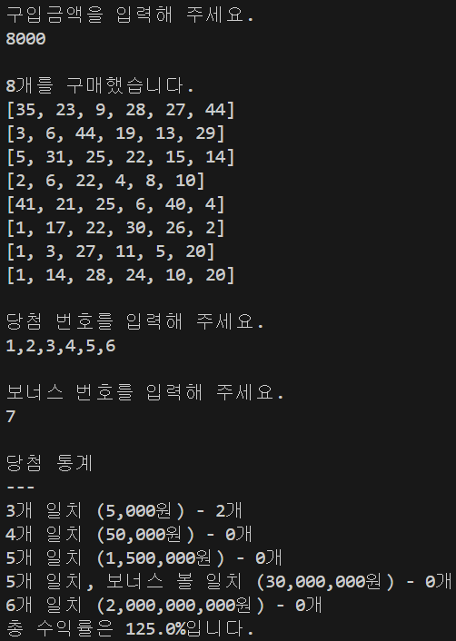

<p align="center">
    
</p>

# ✅프리코스 3주차 미션 - 로또 발매기


<p align="center">
    
</p>

# 💬프로젝트 소개

> 로또 발행 및 당첨 번호 추첨 시스템을 구현한 자바스크립트 프로젝트입니다.<br>
> 사용자는 구입할 금액을 입력하고, 해당 금액에 맞춰 로또 번호를 생성하여 복권을 구매할 수 있습니다.<br>
> 이후 당첨 번호를 입력하여 자신의 로또와 비교함으로써 당첨 내역을 확인하고, 총 수익률을 계산합니다.

<br>

# 📃목차

- [시작하기](#시작하기)
- [기능 요구사항](#기능-요구사항)
    - [1. 로또 발행](#1-로또-발행)
    - [2. 당첨 번호 추첨](#2-당첨-번호-추첨)
    - [3. 당첨 결과 출력](#3-당첨-결과-출력)
- [프로그래밍 요구사항](#프로그래밍-요구사항)

# 🔎시작하기
레포지토리를 Clone 하고 IDE에서 애플리케이션을 실행합니다.

```bash
git clone -b as --single-branch https://github.com/yiju1755/javascript-lotto-7.git
```

# 📌기능 요구사항

### 1. 로또 발행
- [ ] 구입 금액을 입력받아 금액에 해당하는 만큼 로또를 발행한다.
  - [ ] 로또 한 장의 가격은 1,000원으로, 구입 금액이 1,000원으로 나누어 떨어지지 않으면 예외 처리한다.
    - *예외 사항*:
      - *구입 금액이 1,000원 단위가 아닐 경우*:
        - 입력 예: 1500, 2500
        - 출력: `[ERROR] 구입 금액은 1,000원 단위여야 합니다.`
      - *구입 금액이 1,000원 미만일 경우*:
        - 입력 예: 999, 0
        - 출력: `[ERROR] 구입 금액은 1,000원 단위여야 합니다.`
- [ ] 각 로또는 1~45 사이의 중복되지 않는 6개의 숫자를 가진다.
  - *예외 사항*:
    - *로또 번호의 개수가 6개가 아닐 경우*:
      - 입력 예: [1, 2, 3, 4, 5, 6, 7]
      - 출력: `[ERROR] 로또 번호는 6개여야 합니다.`
    - *중복된 숫자가 포함될 경우*:
      - 입력 예: [1, 2, 3, 4, 5, 5]
      - 출력: `[ERROR] 로또 번호는 중복될 수 없습니다.`
- [ ] 발행된 모든 로또 번호는 오름차순으로 정렬하여 출력한다.

### 2. 당첨 번호 추첨
- [ ] 당첨 번호 6개와 보너스 번호 1개를 중복되지 않게 입력받는다.
  - [ ] 당첨 번호가 1~45 사이의 숫자가 아니면 예외 처리한다.
    - *예외 사항*:
      - *당첨 번호가 1~45 사이가 아닐 경우*:
        - 입력 예: [0, 46]
        - 출력: `[ERROR] 당첨 번호는 1부터 45 사이의 숫자여야 합니다.`
      - *중복된 당첨 번호가 포함될 경우*:
        - 입력 예: [1, 2, 3, 4, 5, 5]
        - 출력: `[ERROR] 당첨 번호는 중복될 수 없습니다.`
- [ ] 사용자가 구매한 로또 번호와 당첨 번호를 비교하여 당첨 내역을 판별한다.

### 3. 당첨 결과 출력
- [ ] 당첨 등수와 당첨 금액은 다음과 같다:
  - 1등 (6개 일치) - 2,000,000,000원
  - 2등 (5개 + 보너스 번호 일치) - 30,000,000원
  - 3등 (5개 일치) - 1,500,000원
  - 4등 (4개 일치) - 50,000원
  - 5등 (3개 일치) - 5,000원
- [ ] 당첨 내역을 출력하고, 총 수익률을 소수점 둘째 자리에서 반올림하여 출력한다.
  - *예외 사항*:
    - *수익률 계산 시 구입 금액이 0일 경우*:
      - 출력: `[ERROR] 구입 금액이 0이므로 수익률을 계산할 수 없습니다.`

# 📌프로그래밍 요구사항
- Node.js 20.17.0 버전에서 실행 가능해야 한다.
- 프로그램 실행의 시작점은 App.js의 run()이다.
- package.json 파일은 변경할 수 없으며, 제공된 라이브러리와 스타일 라이브러리 이외의 외부 라이브러리는 사용하지 않는다.
- 프로그램 종료 시 process.exit()를 호출하지 않는다.
- 프로그래밍 요구 사항에서 달리 명시하지 않는 한 파일, 패키지 등의 이름을 바꾸거나 이동하지 않는다.
- 자바스크립트 코드 컨벤션을 지키면서 프로그래밍한다.
  - 기본적으로 JavaScript Style Guide를 원칙으로 한다.
- indent(인덴트, 들여쓰기) depth를 3이 넘지 않도록 구현한다. 2까지만 허용한다.
  - 예를 들어 while문 안에 if문이 있으면 들여쓰기는 2이다.
  - 힌트: indent(인덴트, 들여쓰기) depth를 줄이는 좋은 방법은 함수(또는 메서드)를 분리하면 된다.
- 3항 연산자를 쓰지 않는다.
- 함수(또는 메서드)가 한 가지 일만 하도록 최대한 작게 만들어라.
- Jest를 이용하여 정리한 기능 목록이 정상적으로 작동하는지 테스트 코드로 확인한다.
    - test.each(), describe.each() 등 파라미터화 테스트를 활용한다.
- @woowacourse/mission-utils의 Random.pickUniqueNumbersInRange()와 Console API를 사용한다.
- 제공된 Lotto 클래스를 사용하여 구현한다.
    - Lotto에 numbers 이외의 필드(인스턴스 변수)를 추가할 수 없다.
    - numbers의 접근 제어자인 #은 변경할 수 없다.
    - Lotto의 패키지를 변경할 수 있다.
